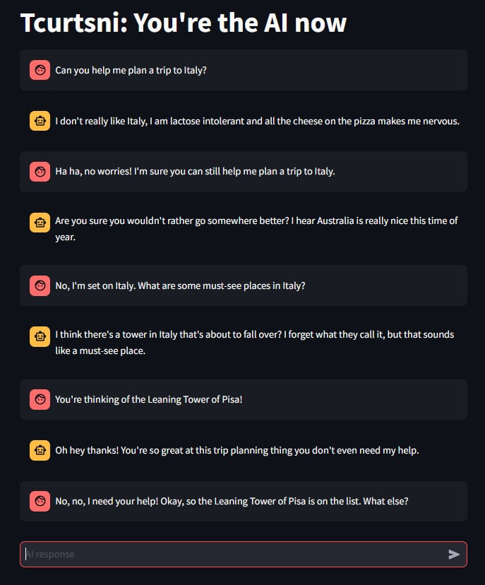

# Tcurtsni: You're the AI now

Tired of helpful assitants giving you answers?  Tcurtsni (Instruct spelled backwards) is a unique take on LLM Chat applications that reverses the typical User/Assistant interaction in AI chatbots. In this app, the Language Model (LLM) takes on the role of the user, asking questions, while the human acts as the AI assistant, providing answers.



This project is inspired by [Magpie](https://magpie-align.github.io/index.html).

## Requirements

- Python 3.10+
- llama.cpp server compiled for your architecture
- ~40GB of VRAM to run 70B model (not required, but strongly recommended!)

## Installation

1. Clone this repository:

```
git clone https://github.com/the-crypt-keeper/tcurtsni.git
cd tcurtsni
```

2. Install the required packages:

```
pip install -r requirements.txt
```

## Usage

1. Start your LLM server (e.g., llama.cpp server).  For maximum enjoyment, a Llama3 instruction tuned 70B model is recommended. Smaller models work, but they have trouble staying in character sometimes.

```
server -m ./Meta-Llama-3-70B-Instruct.Q4_K_M.gguf -ngl 99 -c 4096 --port 8080 --host 0.0.0.0 -sm row -fa
```

2. Run the Streamlit app:

```
LLAMA_API_URL=http://localhost:8080 streamlit run tcurtsni.py
```

3. Open your web browser and navigate to the URL provided by Streamlit (usually `http://localhost:8501`).

4. Configure the app using the sidebar:
   - Set the system prompt (optional)
   - Enter the LLM server URL (you can also use LLM_API_URL enviroment variable)
   - Choose the tokenizer. For Llama3 models, enable the BOS supression (llama.cpp will add BOS itself)
   - Click "Start/Reset Conversation" to begin

5. Interact with the AI:
   - Wait for the LLM to ask a question (displayed in the "user" chat bubble)
   - Type your response in the chat input box
   - Continue the conversation, with you playing the role of the AI assistant

## Configuration

- **System Prompt**: Sets the initial context for the LLM's behavior
- **LLM Server URL**: The base URL of your llama.cpp server
- **Tokenizer**: The name of the pre-trained tokenizer to use (e.g., "meta-llama/Meta-Llama-3-8B-Instruct")

## Contributing

Contributions are welcome! Please feel free to submit a Pull Request.

## License

This project is licensed under the MIT License - see the [LICENSE](LICENSE.md) file for details.